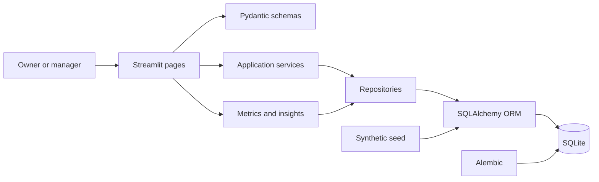
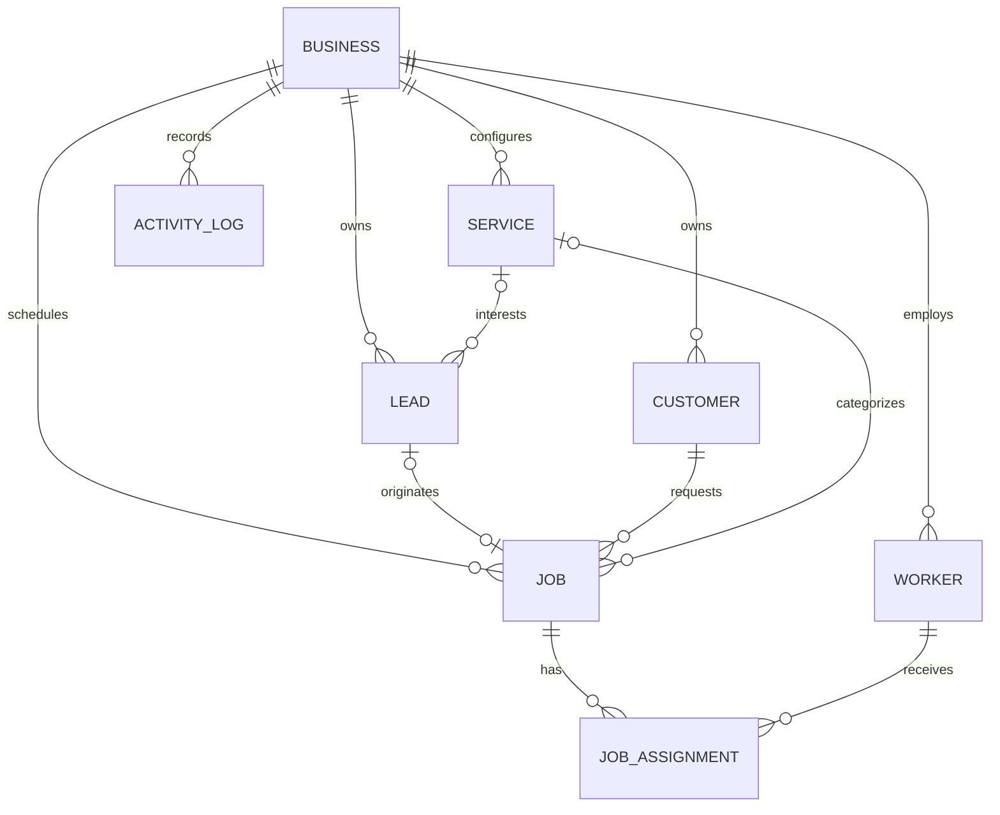

# FieldOps Intelligence

FieldOps Intelligence is a local-first Phase 1 MVP for small field-service businesses. It connects the core operating path—lead capture, qualification, customer creation, job scheduling, worker assignment, and job completion—with clear operational analytics.

The included Summit Outdoor Services workspace is deterministic synthetic data. The domain remains useful for cleaning, maintenance, landscaping, painting, detailing, moving, and other field-service teams.

## Phase 1 capabilities

- Lead pipeline with priorities, sources, ownership, follow-up dates, and controlled status transitions
- Confirmed, transactional qualified-lead conversion that creates one customer and one job
- Customer directory with acquisition context and chronological job history
- Configurable services with pricing, duration, and default cost assumptions
- Job creation, editing, scheduling, staffing, lifecycle transitions, and completion actuals
- Weekly schedule with backlog, staffing gaps, past-due work, and worker overlap warnings
- Overview and analytics for lead conversion, job performance, revenue, duration, cost variance, customer mix, and worker activity
- Deterministic operational insights with named evidence and suggested next actions
- CSV exports for all Phase 1 operating entities and an analytics summary
- Alembic migrations, Pydantic validation, SQLAlchemy transactions, and 31 automated tests

## Architecture

FieldOps is a modular Python monolith. Streamlit renders the interface; Pydantic validates form boundaries; services enforce workflows and transaction rules; repositories provide reusable query shapes; SQLAlchemy persists the relational model; and pure analytics functions keep calculations testable.





More detail is available in [architecture](docs/architecture.md), [data model](docs/data-model.md), [analytics definitions](docs/analytics-definitions.md), and [product decisions](docs/product-decisions.md).

## Quick start

Python 3.12 or newer is required.

### macOS or Linux

```bash
python3.12 -m venv .venv
source .venv/bin/activate
python -m pip install --upgrade pip
pip install -e ".[dev]"
alembic upgrade head
python scripts/seed_demo_data.py
streamlit run app/main.py
```

### Windows PowerShell

```powershell
py -3.12 -m venv .venv
.venv\Scripts\Activate.ps1
python -m pip install --upgrade pip
pip install -e ".[dev]"
alembic upgrade head
python scripts\seed_demo_data.py
streamlit run app\main.py
```

Open the URL printed by Streamlit, normally `http://localhost:8501`.

### Configuration

The application uses safe local defaults. Copy `.env.example` to `.env` only when overrides are needed:

```dotenv
FIELDOPS_DATABASE_URL=sqlite:///fieldops.db
FIELDOPS_LOG_LEVEL=INFO
FIELDOPS_AUTO_SEED=false
```

Business details and insight thresholds are editable on the Settings page. To explicitly clear the configured local database and restore the synthetic workspace, run:

```bash
python scripts/reset_database.py
# or, for an intentional non-interactive reset
python scripts/reset_database.py --yes
```

## Demo dataset

The fixed seed creates 55 leads, 25 customers, 8 services, 4 workers, 40 jobs, their assignments, and 75 activity events. It includes overdue follow-ups, qualified leads awaiting conversion, unstaffed jobs, past-due work, missing actual revenue, cost and duration overruns, and one acknowledged schedule conflict. Email addresses use the reserved example domain; no real customer data is included.

## Quality checks

```bash
ruff format --check .
ruff check .
mypy --no-incremental app scripts
pytest
```

CI runs the same lint, type, and test gates on Python 3.12.

## Repository map

```text
app/
  analytics/          pure Phase 1 calculations and overlap detection
  database/           ORM models, repositories, sessions, and demo seed
  schemas/            validated form and service contracts
  services/           transactional workflows, analytics, insights, exports
  ui/                 eleven Streamlit pages and shared presentation
  utils/              money, dates, validation, and logging helpers
migrations/           Alembic baseline schema
tests/                metric and transactional workflow tests
scripts/              seed, reset, and quality helpers
docs/                 architecture and product definitions
```

## Scope and limitations

This release is a single-process, local SQLite MVP. It has no authentication, role permissions, production tenant isolation, encryption workflow, messaging, calendar sync, mobile/offline client, automated backups, or route optimization. Conflict detection warns and requires acknowledgement; it does not optimize dispatch.

The next roadmap layer may add estimates, invoices, payments, expenses, imports, authentication, roles, managed PostgreSQL deployment, maps, forecasting, and richer statistical analysis. Those capabilities are intentionally not part of Phase 1.

Exports can contain personal information after real data is entered. Operators are responsible for device access, backups, retention, and applicable privacy obligations.

See [CONTRIBUTING.md](CONTRIBUTING.md) for contribution guidance. Released under the [MIT License](LICENSE).
