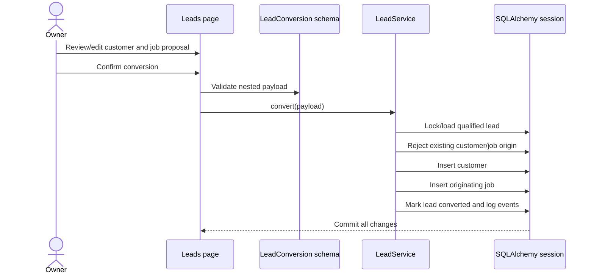

# Architecture

## Supported boundary

Phase 1 runs one Streamlit process against one local SQLite database. Its operating boundary starts with a lead and ends with a completed job, actual results, analytics, and CSV export. The code carries `business_id` on owned records for clear data ownership, but this release does not claim authenticated multi-tenancy.

## Responsibilities

| Layer | Responsibility |
|---|---|
| `app/ui` | Forms, page composition, filters, charts, and user feedback |
| `app/schemas` | Boundary types, formats, ranges, and cross-field validation |
| `app/services` | Use-case orchestration, lifecycle rules, activity events, atomic writes |
| `app/database/repositories` | Business-scoped retrieval and reusable eager-loading shapes |
| `app/database/models` | Tables, relationships, constraints, and persisted enums |
| `app/analytics` | Pure formulas and schedule-overlap detection |
| `migrations` | Versioned schema creation |
| `app/database/seed.py` | Deterministic synthetic operating scenario |

UI modules do not issue lifecycle-changing SQL directly. Services do not import Streamlit. Analytics formulas do not open database sessions.

## Qualified-lead conversion

The page opens one `session_scope()` around conversion. Any validation, constraint, or persistence exception rolls the customer, job, lead status, and activity records back together. Unique originating-lead constraints and service checks prevent duplicate conversions.

## Scheduling and assignment

Scheduling requires an end later than the start. Assigning a worker checks that worker's intervals on other open jobs. A non-empty overlap raises `ScheduleConflict`; the caller may resubmit with explicit acknowledgement. The conflict remains visible on Schedule and in operational insights.

## Transactions, money, and errors

`session_scope()` commits one use case, rolls back any exception, and always closes the session. SQLite foreign keys are enabled for every connection. Financial values use fixed-point database columns and `Decimal`; presentation converts only final aggregates to floats where charts require them.

Pydantic catches boundary errors. `DomainError` and `ScheduleConflict` describe correctable business-rule failures. Unexpected page exceptions are logged and replaced with a generic UI message, without dumping form payloads.

## Deliberate trade-offs

- Streamlit keeps the Phase 1 product Python-only, but a later mobile or highly interactive client may require an API boundary.
- SQLite makes local setup trivial, but is not a production multi-user database.
- JSON business settings are appropriate for a small threshold set; frequently queried settings can be normalized later.
- The baseline Alembic revision creates version-controlled metadata. Subsequent schema changes should use explicit migration operations.
- Analytics run synchronously because the Phase 1 dataset is small and bounded.
