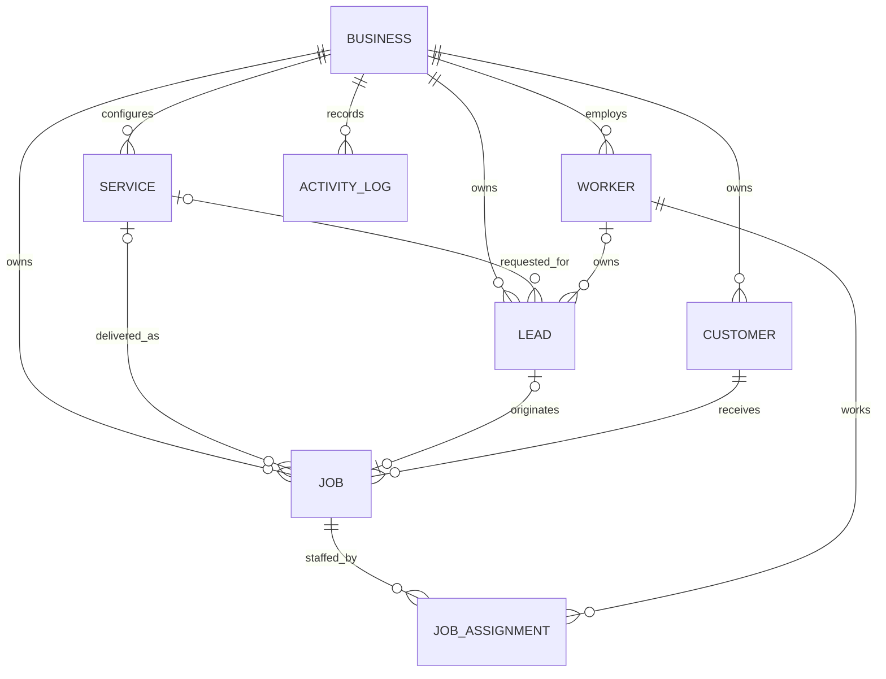

# Data model

Phase 1 contains eight domain entities only.

| Entity | Purpose |
|---|---|
| `Business` | Workspace profile, locale, currency, and insight thresholds |
| `Service` | Configurable work type with pricing, duration, and default cost |
| `Lead` | Pre-sale opportunity with source, owner, follow-up, priority, and terminal outcome |
| `Customer` | Durable person/company record created manually or by conversion |
| `Worker` | Team member available for job assignments |
| `Job` | Quoted, scheduled, delivered work with estimated and actual results |
| `JobAssignment` | Job/worker bridge with expected and actual hours and labour cost |
| `ActivityLog` | Concise lifecycle evidence for leads, customers, and jobs |

## Relationships

## Integrity rules

- Lead statuses are exactly `new`, `contacted`, `qualified`, `follow_up`, `converted`, and `lost`.
- Converted and lost leads are terminal. Losing a lead requires a reason.
- Only a qualified lead can enter conversion.
- A conversion requires explicit confirmation and creates one customer and one job in the same transaction.
- A job's `originating_lead_id` is unique, preventing a second job/customer conversion for the same lead.
- Job numbers are unique within a business.
- Job/worker assignment pairs are unique.
- Scheduled and actual end timestamps must be later than their starts.
- Prices, costs, revenue, and hours are nonnegative and use fixed-point values.
- Optional service links use `SET NULL`; owned assignments use `CASCADE`; critical customer/job history uses restrictive references.
- Normal UI workflows retain history. Inactive services, workers, and customers are not destructively removed.

## Job lifecycle

Jobs may move through `unscheduled`, `scheduled`, `confirmed`, `in_progress`, `blocked`, and terminal `completed` or `cancelled` states according to the transition table in `JobService`. Completion captures actual start/end, final revenue, actual cost, and a completion timestamp. Actual worker hours are stored independently on assignments.

## Retention boundary

The activity log is operational evidence, not a tamper-proof audit ledger. Phase 1 has no automated retention or privacy-erasure workflow. Production use requires jurisdiction-specific access, backup, retention, and deletion policies.
